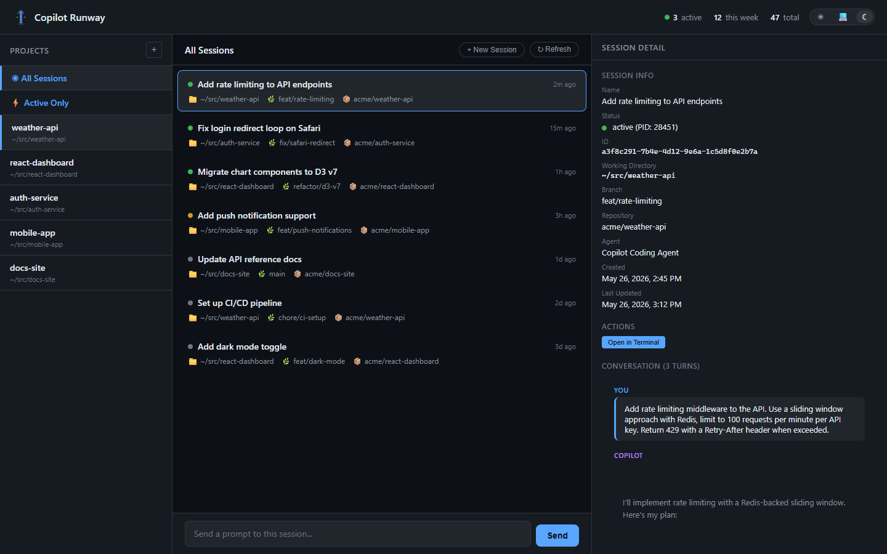

# Copilot Runway

A local web dashboard for visualizing and orchestrating [GitHub Copilot CLI](https://github.com/features/copilot/cli/) sessions across all your projects.

If you work across multiple repos with several Copilot CLI sessions running at once, Runway gives you a single control tower to see what's happening, read conversation history, and send prompts without switching terminals.



## Features

- **Project sidebar**: auto-discovers projects from the Copilot CLI data store; add custom folders on the fly
- **Session list**: view all sessions for a project, filter by active/inactive, sorted by most recent activity
- **Live status**: detects active sessions via PID lock files with process verification
- **Conversation viewer**: read full session history with Markdown rendering (GFM, code blocks, tables)
- **Send prompts**: send one-shot prompts to new or existing sessions, streamed back via SSE
- **Resizable detail panel**: drag to resize, double-click to collapse, auto-expands on session select
- **Agent selection**: choose custom agents for new or existing sessions; Runway remembers the last-used agent per session
- **Localhost only**: binds to `127.0.0.1` with CORS protection

## Prerequisites

- **Node.js 18+**
- **GitHub Copilot CLI** installed and on your `PATH` (`copilot --version` should work)

## Install

Run it instantly with npx (no install required):

```bash
npx copilot-runway
```

Or install globally for a permanent command:

```bash
npm install -g copilot-runway
copilot-runway
```

The server starts and opens your browser automatically:

```
  Copilot Runway running at http://127.0.0.1:3847
```

### From source

```bash
git clone https://github.com/jamesmcroft/copilot-runway.git
cd copilot-runway
npm install
npm start
```

### Development mode

```bash
npm run dev
```

Uses `node --watch` to auto-restart the server on file changes.

## How it works

Runway reads from the Copilot CLI's local data stores (read-only) to build the dashboard:

| Source                                           | What it provides                                               |
| ------------------------------------------------ | -------------------------------------------------------------- |
| `~/.copilot/session-store.db`                    | Session history, conversation turns, checkpoints, file changes |
| `~/.copilot/data.db`                             | Project list (repos you've used with the CLI)                  |
| `~/.copilot/session-state/<id>/workspace.yaml`   | Session name, working directory, branch, git root              |
| `~/.copilot/session-state/<id>/inuse.<pid>.lock` | Active session detection (PID verified against OS)             |

Custom projects and app settings are stored in `~/.runway/` to keep Runway's data separate from the CLI's databases:

| File                            | Purpose                                                           |
| ------------------------------- | ----------------------------------------------------------------- |
| `~/.runway/projects.json`       | Custom project folders added through the dashboard                |
| `~/.runway/session-agents.json` | Last-used agent per session (auto-populated when sending prompts) |

When you send a prompt, Runway spawns a `copilot` process with `-p "your prompt" --output-format json` and streams the JSONL output back to the browser via Server-Sent Events. You can optionally select a custom agent (via the CLI's `--agent` flag) — Runway remembers your choice per session.

### Live updates

The dashboard subscribes to `/api/events` (Server-Sent Events) for push-based updates so the UI reflects CLI activity within milliseconds instead of waiting for a periodic poll. The server watches two surfaces:

- `~/.copilot/session-state/` (recursive `fs.watch`) for session directory and `inuse.<pid>.lock` changes
- `~/.copilot/session-store.db` and its `-wal` sidecar (hybrid `fs.watch` plus periodic `fs.stat` mtime heartbeat) for write activity, with a 250 ms debounce so the burst of WAL commits from a single CLI turn produces one event

The event channel publishes the following types:

| Event              | Trigger                                                              | Data                                  |
| ------------------ | -------------------------------------------------------------------- | ------------------------------------- |
| `ready`            | Sent immediately on each successful connection                       | `{ at }`                              |
| `session.created`  | New directory under `~/.copilot/session-state/`                      | `{ sessionId, at }`                   |
| `session.active`   | `inuse.<pid>.lock` appears and the PID is alive                      | `{ sessionId, pid, at }`              |
| `session.inactive` | `inuse.<pid>.lock` disappears or the PID fails a liveness probe      | `{ sessionId, at }`                   |
| `session.ended`    | Session directory removed                                            | `{ sessionId, at }`                   |
| `db.activity`      | Debounced write activity on `session-store.db` or `-wal`             | `{ at }`                              |
| `state.snapshot.end` | Marks the end of the initial state snapshot on a new connection    | `{ count, at }`                       |

On every new connection the server sends `ready`, then one `session.active` or `session.inactive` frame per known session under `~/.copilot/session-state/` (classified by the same PID liveness check used for live emissions), then `state.snapshot.end` with the total snapshot count, and only after that the live delta stream. Snapshot frames are sent only to the new client's stream, never broadcast. Subscribers can therefore build full session state from the SSE stream alone, without a parallel REST call. Any events fired by the watcher during the snapshot read are captured in a per-connection buffer and drained immediately after `state.snapshot.end`, so no state change can be lost in the gap.

Frames are encoded as `event: <type>\ndata: <json>\n\n` and a comment heartbeat (`: heartbeat\n\n`) is sent every 25 seconds to defeat idle-proxy timeouts. EventSource clients ignore comment lines.

If the SSE connection drops, the dashboard reconnects with exponential backoff (1s, 2s, 4s, 8s, 16s, capped at 30s). After three consecutive failures, or if the browser does not support `EventSource`, the client falls back to a 30 second polling loop. The fallback is cancelled automatically the next time SSE reconnects and emits `ready`.

### Concurrency safety

Runway only ever reads the CLI's SQLite files via `better-sqlite3` in read-only mode (WAL-safe) and subscribes to filesystem change notifications. It never locks or writes the CLI's files, so there is no interference with the CLI as the active writer. `fs.watch` events from SQLite WAL commits are debounced (250 ms) to avoid event storms.

## Project structure

```
copilot-runway/
├── server.js          # Express app wiring: middleware, static assets, route mounting, listen
├── lib/
│   ├── paths.js               # Shared filesystem path constants; ensures ~/.runway exists
│   ├── cli/
│   │   ├── spawn.js           # `copilot` CLI spawn helper + running-process registry
│   │   └── agents.js          # List available custom agents (cached) via the CLI
│   ├── store/
│   │   ├── db.js              # Read-only openers for ~/.copilot/session-store.db and data.db
│   │   └── sessions.js        # workspace.yaml reader, lock-file/PID status, find-new-session-id
│   ├── runway/
│   │   ├── projects.js        # Load/save ~/.runway/projects.json (custom folders)
│   │   └── session-agents.js  # Load/save ~/.runway/session-agents.json (per-session agent)
│   ├── watchers/
│   │   ├── lifecycle.js       # fs.watch on ~/.copilot/session-state/, emits session.* events
│   │   └── db.js              # Hybrid fs.watch + mtime heartbeat on session-store.db, emits db.activity
│   └── routes/
│       ├── projects.js        # GET /api/projects, POST /api/projects/add
│       ├── sessions.js        # GET /api/sessions, /sessions/active, /sessions/:id
│       ├── send.js            # POST /api/sessions/send (SSE stream of CLI events)
│       ├── agents.js          # GET /api/agents
│       ├── stats.js           # GET /api/stats
│       └── events.js          # GET /api/events (SSE stream of lifecycle and DB events)
├── bin/
│   └── copilot-runway.js  # CLI entry point (npx / global install)
├── public/
│   ├── index.html     # Single-page app shell
│   ├── styles.css     # Light and dark themed styles
│   ├── app.js         # Frontend — rendering, themes, resize, markdown, API calls
│   ├── logo.svg       # App logo
│   └── favicon.svg    # Browser tab icon
├── .github/
│   ├── workflows/ci.yml   # CI + npm publish pipeline
│   ├── dependabot.yml
│   └── ISSUE_TEMPLATE/
├── package.json
├── LICENSE
└── README.md
```

### Module boundaries

The backend is split along three concerns so the upcoming WebSocket bridge has a clean place to live:

- **`lib/cli/`** owns every interaction with the `copilot` binary (spawn, agent discovery, the running-process registry).
- **`lib/store/`** owns read-only access to the Copilot CLI's own state under `~/.copilot/` (the two SQLite databases and per-session `workspace.yaml` + `inuse.<pid>.lock` files).
- **`lib/runway/`** owns Runway's own config files under `~/.runway/` (custom projects, per-session agent selection).
- **`lib/routes/`** contains one Express router per resource. Routers depend on the three layers above; they never reach into the filesystem or spawn processes directly.
- **`server.js`** is wiring only: it sets up middleware (JSON body, CORS, static assets), mounts the routers under `/api/...`, and starts the listener.

## API reference

All endpoints are localhost-only with CORS origin protection.

| Method | Path                                              | Description                                                                     |
| ------ | ------------------------------------------------- | ------------------------------------------------------------------------------- |
| `GET`  | `/api/projects`                                   | List all projects (CLI + custom), sorted by recent activity                     |
| `POST` | `/api/projects/add`                               | Add a custom project folder (`{ folderPath, name? }`)                           |
| `GET`  | `/api/sessions?cwd=...&limit=50&active_only=true` | List sessions, optionally filtered by directory                                 |
| `GET`  | `/api/sessions/active`                            | List all active sessions across all projects                                    |
| `GET`  | `/api/sessions/:id`                               | Session detail with full conversation, checkpoints, and files                   |
| `POST` | `/api/sessions/send`                              | Send a prompt (SSE stream). Body: `{ prompt, sessionId?, cwd?, name?, agent? }` |
| `GET`  | `/api/agents`                                     | List available custom agents (cached 5 min)                                     |
| `GET`  | `/api/stats`                                      | Dashboard stats (total sessions, active count, recent activity)                 |
| `GET`  | `/api/events`                                     | SSE stream of session lifecycle and DB activity events                          |

## Configuration

| Environment variable | Default | Description                                 |
| -------------------- | ------- | ------------------------------------------- |
| `PORT`               | `3847`  | Server port (change in `server.js` for now) |

Theme preference and panel width are stored in the browser's `localStorage`.

## Contributing

Contributions are welcome. To get started:

1. Fork the repo and clone your fork
2. `npm install`
3. `npm run dev` to start with auto-reload
4. Make your changes and test locally
5. Open a PR with a clear description of what you changed and why

## License

[MIT](LICENSE)
